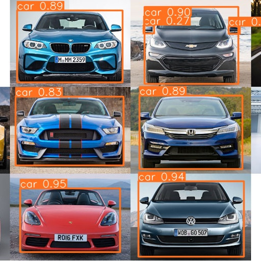

+++
title = 'Object Detection'
summary = 'As bad as Humans.'
date = 2024-03-15T08:51:12Z
draft = false
tags = ['goal', 'machine learning', 'pytorch']
+++
**Goal #3** will involve detecting objects but behold ML detecting too much:



This script:
```
from ultralytics import YOLO
model = YOLO('weights/yolov8n.pt') # nano
results = model('cars-512.jpg', imgsz=512, save=True, conf=0.1) # savses in runs/detect/predict
```

The `conf` parameter filters all matches with lower confidence out.

Note that I originally uded a `show=True` parameter but it just blocked on *Linux*.
You can find more information on the [libraries' github page](https://github.com/ultralytics/ultralytics/tree/main?tab=readme-ov-file).
