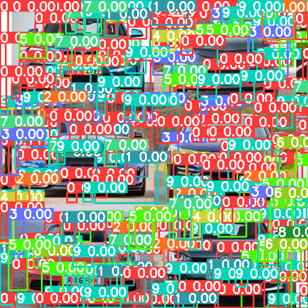

+++
title = 'Detecting things'
summary = 'Old guides everywhere.'
date = 2024-03-20T00:02:03Z
draft = true
tags = ['docker', 'label-studio']
+++
I was looking up some guides but they are rather outdated. I found [this one](https://betterdatascience.com/detect-license-plates-with-yolo/) which used [LabelIMG](https://github.com/HumanSignal/labelImg) (now  part of **Label Studio**).

First of all I needed a way to run [Docker](https://docs.docker.com/get-docker/) so I followed the guide. This was unnecessary since it could work fine as a local server but it guarantees that the environment is set up.

Once that was done I could open [Label Studio]() by running `sudo docker run -it -p 8080:8080 -v $(pwd)/mydata:/label-studio/data heartexlabs/label-studio:1.6.0`, use it and export a *JSON* file.

You must avoid setting the confidence too low (in this case I was testing a [Meter Reader on HuggingFace](https://huggingface.co/spaces/youssefboutaleb/Yolov8_meter)):

