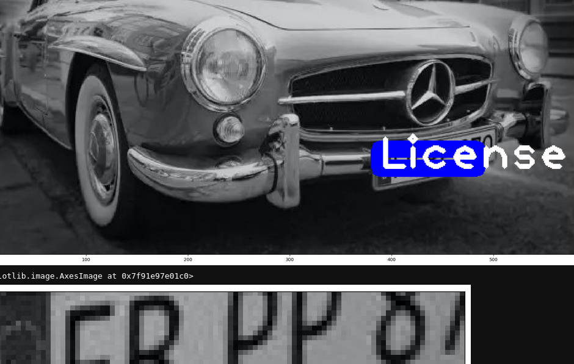
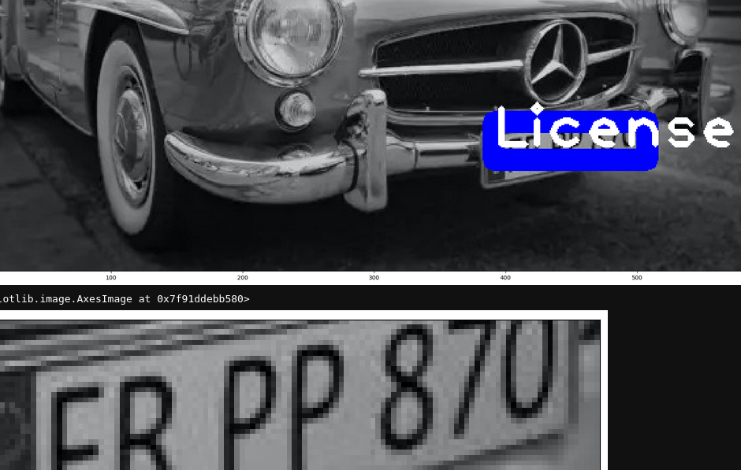
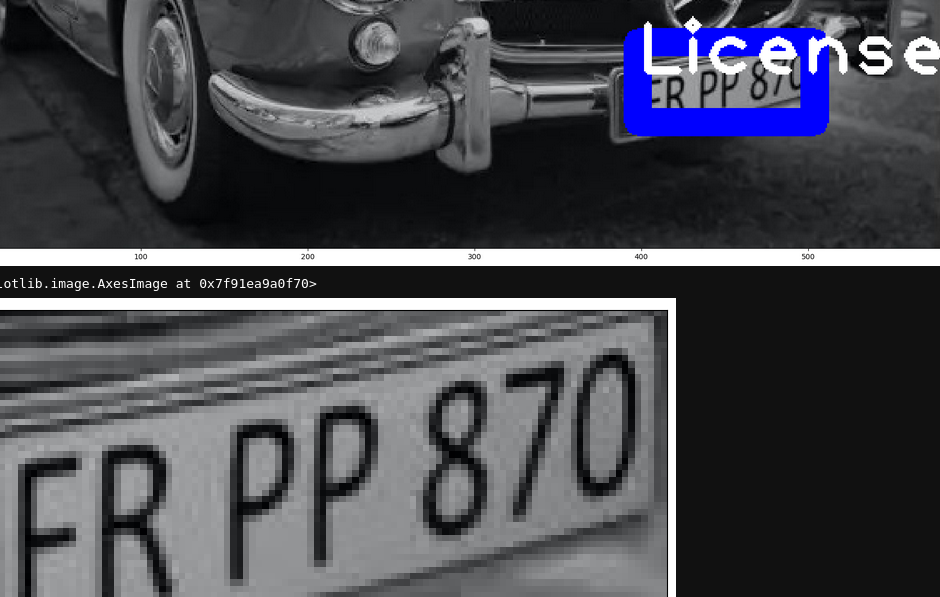

+++
title = 'Darknet 7'
summary = 'What to do with labeled images.'
date = 2024-04-01T09:35:59Z
draft = false
tags = ['yolo', 'goal 3', 'google colab', 'jupyter notebook', 'github']
+++
Got the Colab notebook to continue accordingly by using `$root_dir/yolo-license-plates/yolov3-train_last.weights` instead of `$DN/darknet53.conv.74` as the last argument. Thanks to [this guide](https://github.com/pjreddie/darknet/issues/1458) for that, while obvious I'm not experienced with **Darknet**.

This also produced **_best.weights** although they were just panned and of little relevance.



Aside from **_last.weights**, I was able to capture a separate result that was between the first and last weights.



The last detection, for now, already captures the important part of the license plate (in this case the training targets the letters and numbers and not the whole thing which the weights reflect).



Notice that this is found in the output.

```
New best mAP!
Saving weights to /yolo-license-plates/yolov3-train_best.weights
Saving weights to /yolo-license-plates/yolov3-train_last.weights
```

