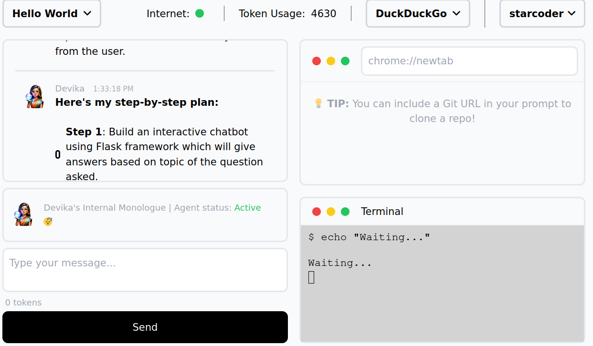

+++
title = 'Devika'
summary = 'How to set it up with Ollama on Linux'
date = 2024-04-02T08:32:49+01:00
draft = true
tags = ['devika', 'ollama', 'linux']
+++
I'm interested in trying [Devika](https://github.com/nalaso/devika/) out so here's how I installed it.

```
https://github.com/nalaso/devika/
cd devika
python -m venv env # using this instead of uv
source env/bin/activate
playwright install
python3 -m playwright install-deps
cd ui
bun install
cd ..
```

Now it'll need two/three terminals, one for `ollama run starcoder`, one for `python devika.py` and one for `cd ui; bun run dev`.
Make sure to select an Ollama model on the third dropdown.


