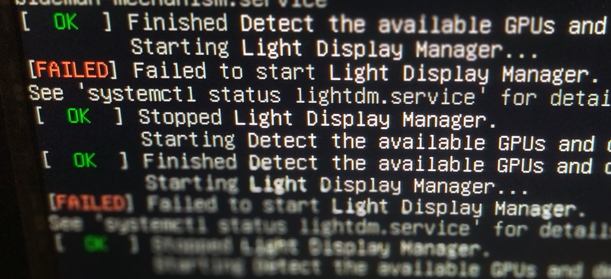

+++
title = 'Linux shenanigans'
summary = 'Oddities obsserved.'
date = 2024-04-21T08:32:49+01:00
draft = false
tags = ['linux']
+++
So I've been noticing some odd behaviors on my machine.
At first it was just an ACPI error, it affects the firmware somehow.

 and 

It mostly works despite those errors.

But sometimes it may stop boot altogether:

And sometime installation failed as well, stopping me from deploying some distributions.

