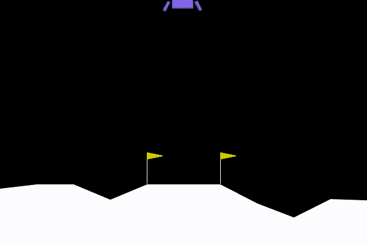

+++
title = "RL does not work?"
summary = "70% of the times."
date = 2025-02-27T08:10:34+01:00
draft = false
tags = ['ai', 'games', 'gymnasium', 'stable baselines 3', 'python']
+++
+++
Unfortunately some of the times it does not work, and it's no wonder since we're just checking if mostly random results that we got performs well. It's a brute-force method.

[Check this article out, it's a realistic take on the subject.](https://www.alexirpan.com/2018/02/14/rl-hard.html)

Anyway it is still amazing when it does work. [Even outdated environments can teach you a lot.](https://towardsdatascience.com/how-to-train-an-ai-to-play-any-game-f1489f3bc5c/)



This example uses the default environment (*LunarLander-v3*). Thanks to [Mistral](https://chat.mistral.ai/chat) for the code to save a GIF.

Here's the [Python](https://www.python.org/) script in case you want to try yourself:

```
# pip intall gymnasium==1.0.0
# pip show gymnasium
# pip install stable-baselines3==2.5.0
# pip show stable-baselines3

import numpy as np
import gymnasium as gym

from stable_baselines3 import PPO
from stable_baselines3.common.env_util import make_vec_env
from stable_baselines3.common.monitor import Monitor
from stable_baselines3.common.callbacks import EvalCallback

import os
LOGDIR = 'log'
TIMESTEPS = 100000

os.makedirs(LOGDIR, exist_ok=True)

render = input("Render (y/N) ? ")
train = ''
if 'y' in render.lower():
    TIMESTEPS = 1
    env = gym.make("LunarLander-v3", render_mode="human")
else:
    env = gym.make("LunarLander-v3", render_mode='rgb_array')
    train = input("Train (y/N) ? ")
    
                             
env = Monitor(env, LOGDIR)

eval_callback = EvalCallback(env, best_model_save_path='./' + LOGDIR + '/', log_path='./' + LOGDIR + '/', eval_freq=5000, deterministic=False, render=False)

model = PPO("MlpPolicy", env, verbose=0)

if os.path.exists(LOGDIR + "/best_model.zip"):
    model.set_parameters(LOGDIR + "/best_model.zip")
if train:
    model.learn(total_timesteps=TIMESTEPS, callback=eval_callback)

vec_env = model.get_env()
obs = vec_env.reset()
frames = []
for i in range(1000):
    action, _states = model.predict(obs, deterministic=True)
    obs, reward, done, info = vec_env.step(action)
    if not train:
        frame = vec_env.render(mode='rgb_array')
        frames.append(frame)
    # VecEnv resets automatically
    # if done:
    #   obs = env.reset()

env.close()

if not render and not train:
    save = input("Save GIF (y/N) ? ")
    if 'y' in save.lower():
        import imageio # pip install imageio
        GIF_PATH = 'best.gif'
        
        # Reset the environment and unpack the tuple
        obs, info = env.reset()  # Gym API returns (obs, info)
    
        imageio.mimsave(GIF_PATH, frames, fps=12)
        print(f"GIF saved to {GIF_PATH}")
```
