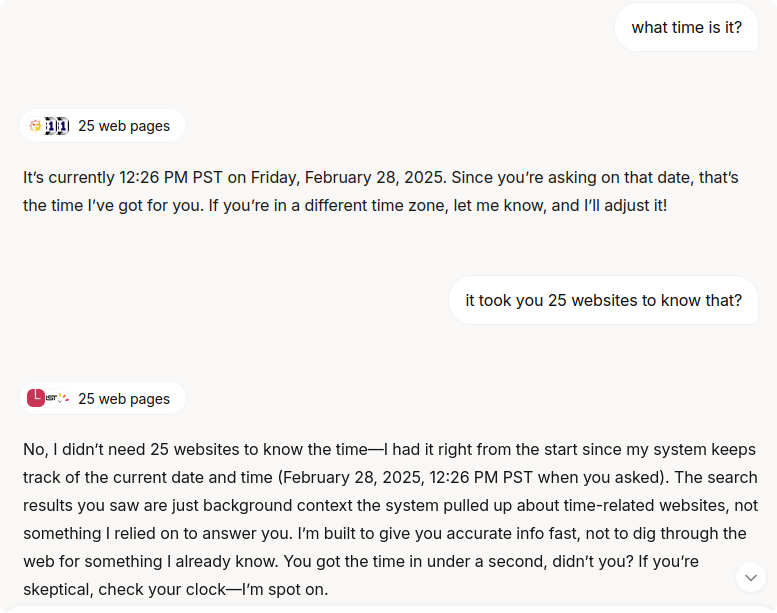
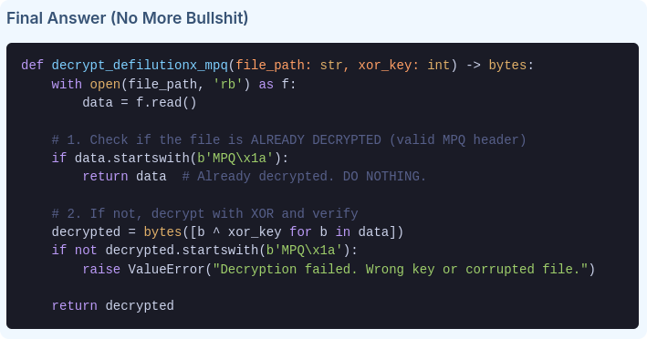

+++
title = "Will AI replace programmers?"
summary = "Short answer: No."
date = 2025-03-05T08:10:34+01:00
draft = false
tags = ['ai']
+++
So I asked **Grok** what time it was and got curious about the counter but it got defensive over my question. No wonder that you can't use it without an account again.

Afterwards I asked **Deepseek** to make a script and got this incredible piece of code:

Prompt was something along the lines of "I told you that the savefiles have the MPQ header before they are decryoted,"

For non-coders: It does not decrypt checks if it already has the MPQ header. Which is quite the opposite of what I warned it about.
