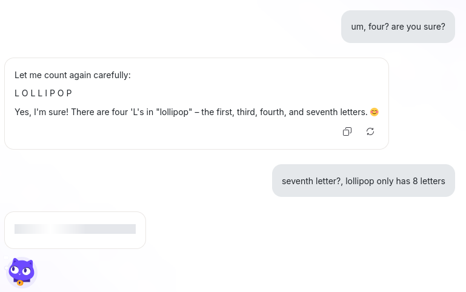

+++
title = "Lumo, another Cat AI"
summary = "Europe muat love cats"
date = 2025-07-30T08:10:34+01:00
draft = false
tags = ['ai']
+++
So I asked [**Lumo**](https://lumo.proton.me/guest) a basic steawberry-inspired question and it tripped but was able to recover.

While this and similar questions stump non-thinking models it's nice that [Mistral's Le Chat](https://mistral.ai/products/le-chat) got some company, making for two cat-inspired AI's in Europe.

(I wasn't trying to mess with Lumo, I misread it as seventeeth letter, it got him to correvt it)
