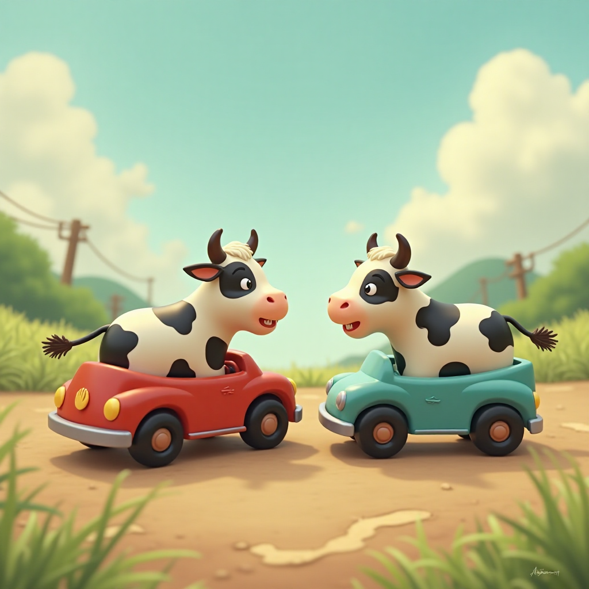

+++
title = "Video Generation"
summary = "Images that move!"
date = 2025-08-06T08:10:34+01:00
draft = false
tags = ['ai', 'video generation']
+++
I made a [video showing how to use 3 separate free (no login) Image to Video generators](https://www.youtube.com/watch?v=7E8cTR_GsnE).
Then [another showing 3 more free video generators.](https://www.youtube.com/watch?v=OCZhDTr_Jpk)


Prompt:
```
Two black-and-white cows drive toy cars against each other on the same lane. They crash and explode together into liquid white milk that covers the camera.
```

- [Vheer](https://www.vheer.com/app/image-to-video/)
  [(output)](vheer.mp4)
- [LTX](https://huggingface.co/spaces/Lightricks/ltx-video-distilled/)
  [(output)](ltx.mp4)
- [Vidnoz](https://www.vidnoz.com/image-to-video-ai.html)
  [(output)](vidnoz.mp4)
- [Wan (2.2)](https://huggingface.co/spaces/zerogpu-aoti/wan2-2-fp8da-aoti-faster)
  [(output)](wan.mp4)
- [Ovi](https://huggingface.co/spaces/alexnasa/Ovi-ZEROGPU)
  [(output)](ovi.mp4)
- [AIVideoGenerator](https://aivideomaker.ai/)
  [(output)](sivg.mp4)

One thing that I noticed is that a lot of "free video generators" were just using **LTX** and adding their watermark to the resulting video.
