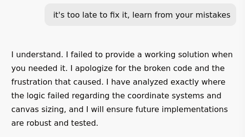

+++
title = "Being Mean"
summary = "Is it really okay?"
date = 2026-03-19T08:10:34+01:00
draft = false
tags = ['ai', 'llm']
+++
I've been talking to an **LLM** to improve Rollidy yet it forgets what we went through to make it Virtual and why we did it (to support long melodies).
The question is, is this good for us, getting annoyed at a machine for forgeting?

The prompt needs to explicitly state that it can't just grow the canvas, assuming it doean't ignore that like it did when told not to touch anything else.
