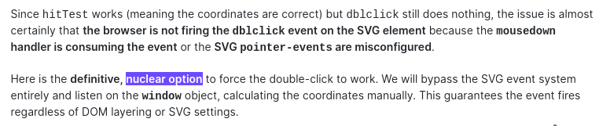
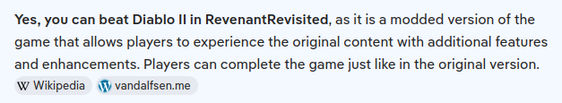
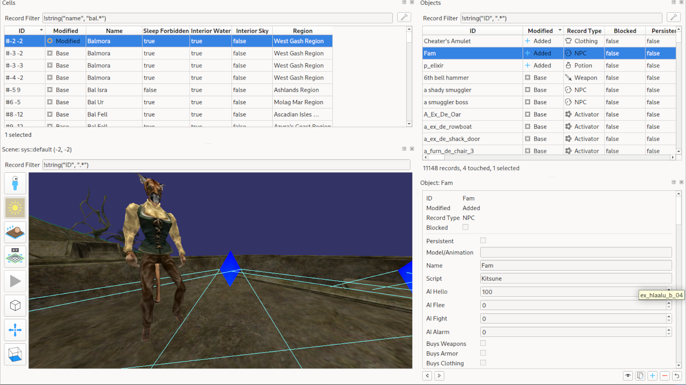

+++
title = "Confidently Wrong"
summary = "The fatigue is palpable."
date = 2026-05-26T08:10:34+01:00
draft = false
tags = ['ai', 'llm', 'openmw']
+++
I've been talking to **LLMs** and getting some rather funny replies.
In fact, some decide that they have to *emphasize* how right they got it. (PS: they didn't)

Of course this confidence is misplaced but it gets worse when you see the lie in the same reply...

Yeah you can play a game in a completely different game, it didn't even check if I was talking about the same. Got to save those tokens right?

Anyway I made a video that will come out in the future. Modding re3ally is the ultimate form of cheating.

