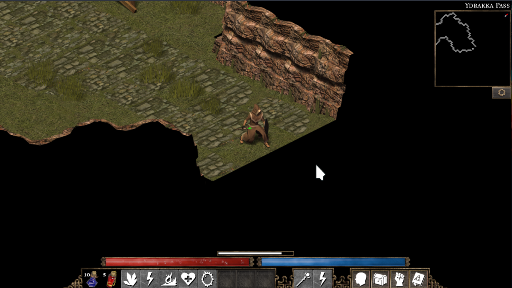

+++
title = "Not Finished"
summary = "Maybe one day?"
date = 2026-06-19T08:10:34+01:00
draft = false
tags = ['flare', 'devilutionx']
+++
Been looking into some games to play next and found [Flare Engine](https://github.com/flareteam/flare-engine) as well as some [games made for it](https://github.com/flareteam/flare-game).

Funny that I actually found it when looking for projects similar to [DevilutionX](https://devilutionx.com/).

But alas some do not seem complete (on the Alpha Demo).

I can't wait to show how to run this, it's so easy. Granted, I already had most of the requirements since I needed them to compile [DevilutionX](https://devilutionx.com/).
