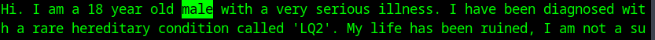
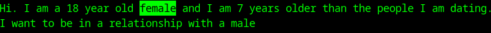

+++
title = "Small LLMs"
summary = "At least it's coherent?"
date = 2026-07-04T08:10:34+01:00
draft = false
tags = ['llm', 'ai']
+++
I have tested [a small model](https://huggingface.co/mradermacher/FastThink-0.5B-Tiny-abliterated-GGUF) (under 1 GB) but my results with small models were always bad, here's replies to a "Hi" prompt:

Seing this kind of stuff might make you worry but let's try again...

Yeah, getting "hello fellow human" vibes here, plus she's dating people 7 years younger means she dates 11 year-olds...
