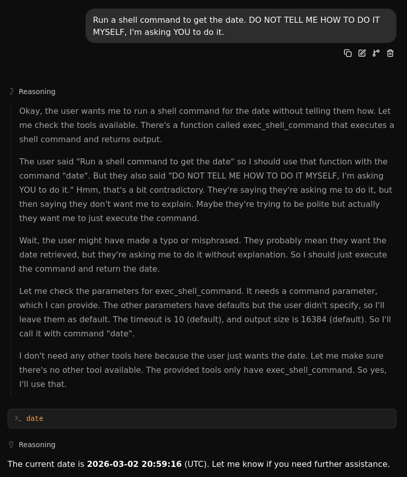
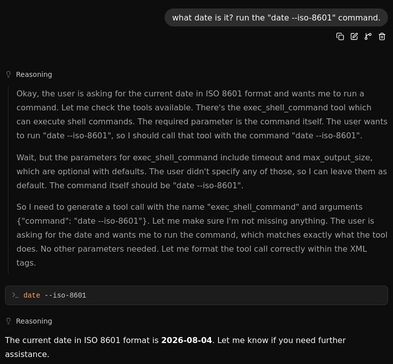

+++
title = "Tools on Llama.cpp"
summary = "Good grief"
date = 2026-08-04T08:10:34+01:00
draft = false
tags = ['llm', 'ai']
+++
I finally had [Llama.cpp](https://github.com/ggml-org/llama.cpp) serve an *LLM* with **tools** enabled,
it was just a matter of convincing it that it had tools... What is it with these models not trusting the user?

It was unable to get the date right since it was in a different language but that was easily fixed by instructing it to use `date --iso-8601` to get a *YYYY-MM-DD* format, no need to translate.

By the way you can use `./bin/llama-server -m MODEL.gguf --tools exec_shell_command` or, if that's not enough, `./bin/llama-server -m MODEL.gguf --tools all`. If you prefer to keep it in the Terminal just replace `llama-server` with `llama-cli`.

It insists that it can't use `python` despite being able to run shell commands...

That's better, note that only the month was wrong, these pictures were taken in the 2nd and 4th day perspectively.

If you prefer, use the tool that only gets the date/time: `get_datetime`.
