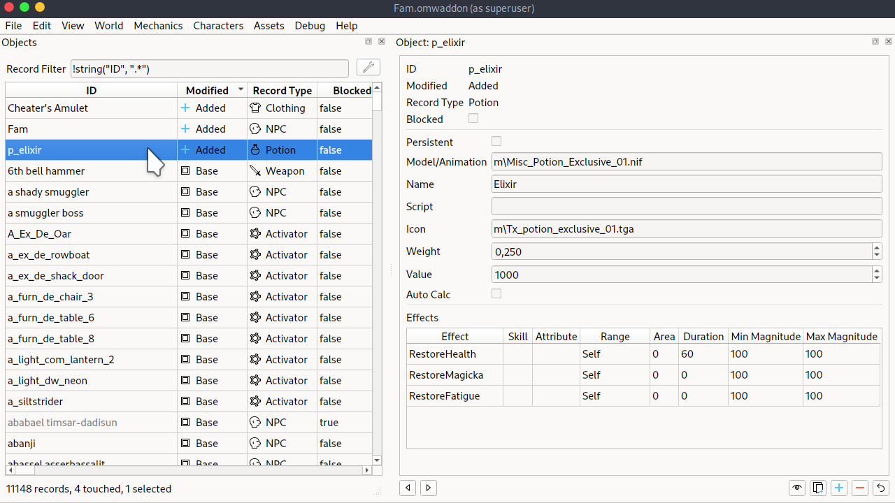
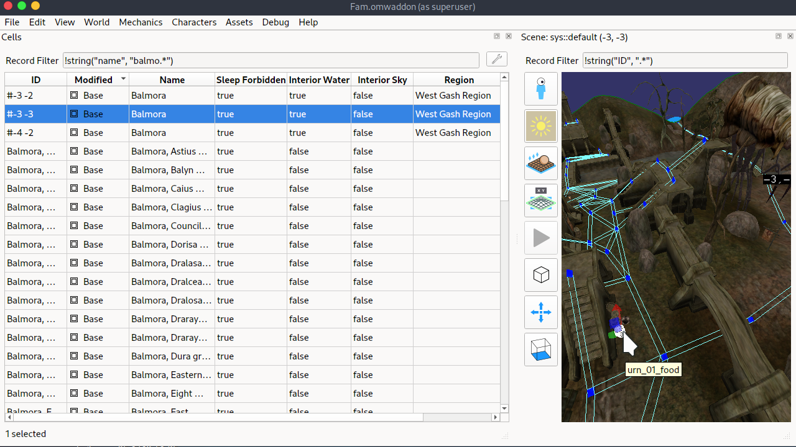
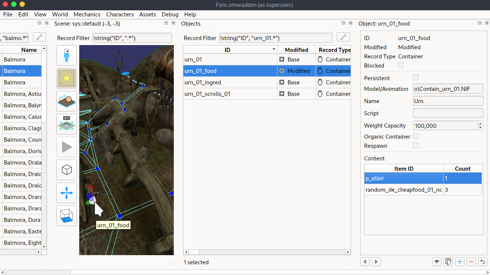
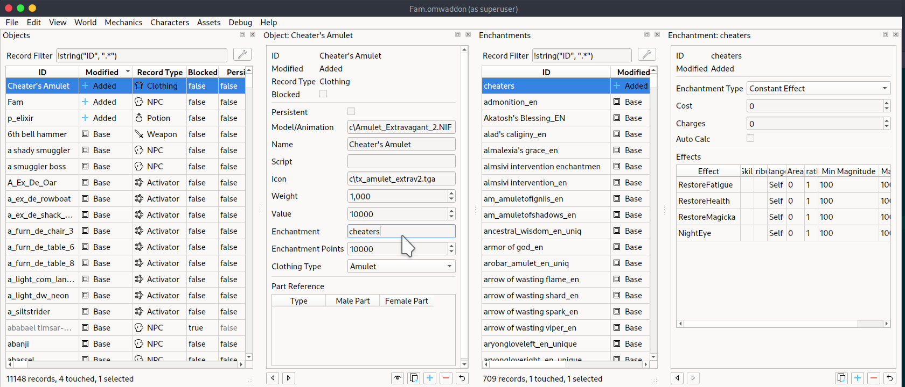
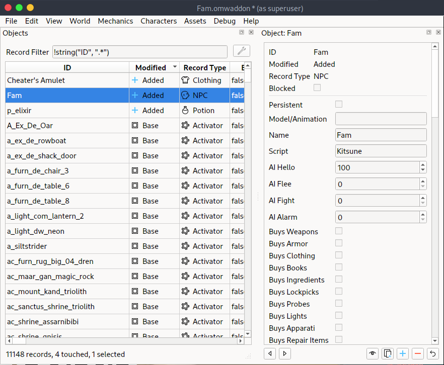
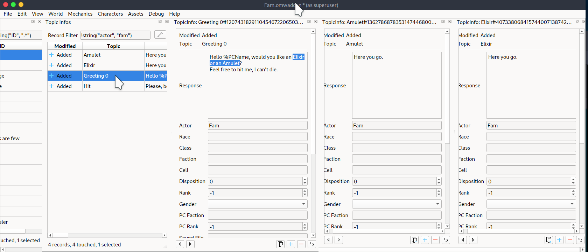
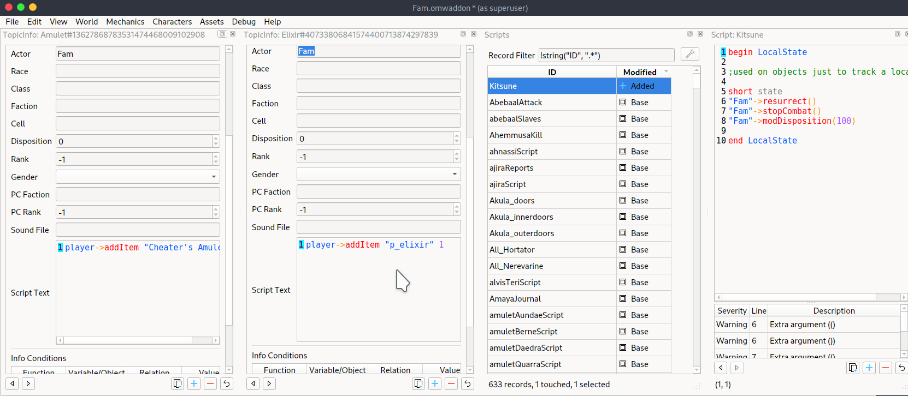
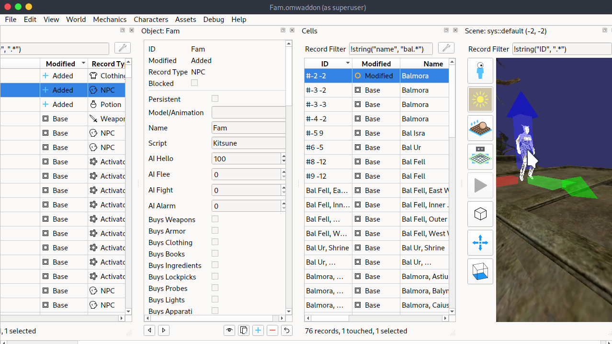
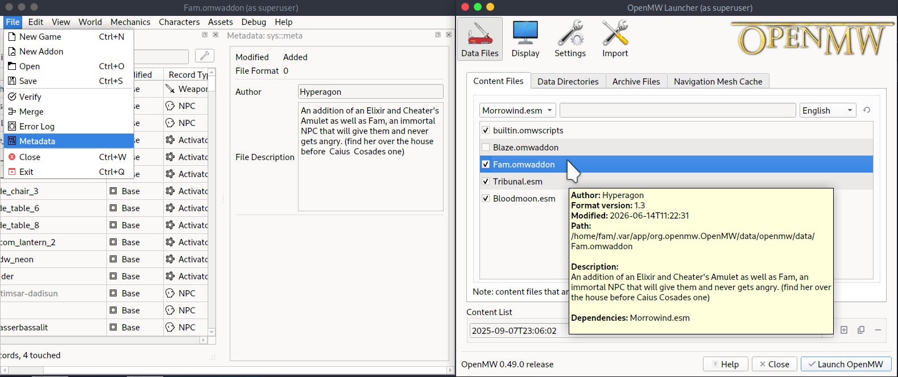

+++
title = "OpenMW Modding"
summary = "Modding is the ultimate form of Cheating."
date = 2026-06-08T08:10:34+01:00
draft = false
tags = ['modding', 'openmw']
+++
"*Modding is the ultimate form of Cheating*" and I [made a video](https://www.youtube.com/watch?v=V5Ik3wGSjOE) that will come out after [Fam](https://www.youtube.com/watch?v=IJ9In8cL_mc&list=PLoa8A9b-8ZhFk2qVcO4zzN1FcG5KwqSlu) is done completing [OpenMW](https://openmw.org/). Parts of this overlaps with what was done in [this guide](https://openmw.readthedocs.io/en/stable/manuals/openmw-cs/tour.html).

For starters let's make an *Elixir* that recovers everything.

Now locate the left-most urn after going down from the Silt Strider in Balmora.

Then edit that record to have that new item.

And let's also make a *Cheater's Amulet* with the same effect but constant (every second).

Now we need to clone Fargoth or any other NPC.

Then edit his/her dialog. (Topic and Topic Info)

In the scripts you can use console commands. See which are available in [this list](https://wiki.openmw.org/index.php?title=Scripting_%28status%29) and learn more from [this tutorial](https://en.uesp.net/wiki/Morrowind_Mod:Scripting_for_Dummies).

Now *View* the Cell and drag-and-drop the NPC on it.

Add metadata and the addon before playing.

Try it out by putting [this file](Fam.omwaddon) in `~/.var/app/org.openmw.OpenMW/data/openmw/data/`
